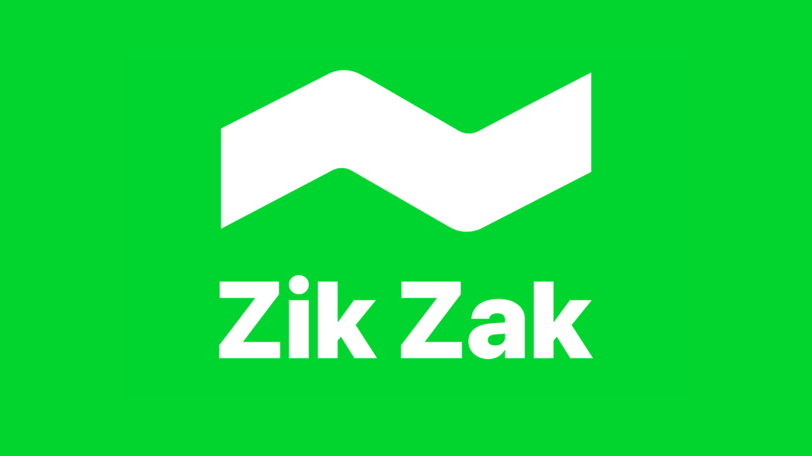

<div align="center">

# 🚀 ZikZak InAppWebView <a href="https://zread.ai/arrrrny/daytona" target="_blank"></a>

### _The Feature-Rich WebView Plugin for Flutter_


---

A Flutter plugin that allows you to add an inline WebView, use an headless WebView, and open an in-app browser window.
This is a community-driven fork of `flutter_inappwebview` focused on active maintenance, stability, and modern platform support.

## Sponsor

[](https://zuzu.dev) [](https://zuzu.dev)

Thanks to ZikZak AI for sponsoring this project!

ZikZak AI is an AI-Powered Price Comparison app that you scan barcodes, and discover amazing savings instantly. Your personal shopping assistant that never sleeps.

<a href="https://apps.apple.com/tr/app/zik-zak/id1563425450"></a>
<a href="https://play.google.com/store/apps/details?id=dev.zuzu.zingo"></a>

[**Documentation**](https://arrrrny.github.io/zikzak_inappwebview/) | [**Pub.dev**](https://pub.dev/packages/zikzak_inappwebview) | [**API Reference**](https://pub.dev/documentation/zikzak_inappwebview/latest/) | [**Changelog**](https://github.com/arrrrny/zikzak_inappwebview/blob/master/zikzak_inappwebview/CHANGELOG.md)

</div>

---

## ✨ Key Features

- **All 6 Platforms**: Android, iOS, Web, macOS, Windows, and Linux.
- **In-App Browser**: Full-featured browser window inside your app with toolbar, progress bar, and navigation controls.
- **Headless WebView**: Run WebView in the background without a UI — perfect for scraping, pre-rendering, or data extraction.
- **Rich API**: Comprehensive control over navigation, cookies, JavaScript evaluation, content blockers, scripts, and more.
- **Modern Security**: Enhanced URL validation, content process recovery, and OEM crash protection.
- **SPM + CocoaPods**: iOS now uses Swift Package Manager for smaller app sizes and faster builds.

## 📦 Installation

Add `zikzak_inappwebview` to your `pubspec.yaml`:

```yaml
dependencies:
  zikzak_inappwebview: ^4.6.0
```

## ⚙️ Requirements

| Platform    | Minimum Version | Notes                     |
| ----------- | --------------- | ------------------------- |
| **Flutter** | 3.10.0+         |                           |
| **Android** | API 24+         | Android 7.0+              |
| **iOS**     | 16.0+           |                           |
| **macOS**   | 12.0+           |                           |
| **Windows** | 10+             | Requires WebView2 Runtime |
| **Linux**   |                 | Requires WebKitGTK 2.40+  |
| **Web**     | Any             |                           |

## 🚀 Getting Started

Check out the [online documentation](https://arrrrny.github.io/zikzak_inappwebview/) for comprehensive guides and examples.

```dart
import 'package:zikzak_inappwebview/zikzak_inappwebview.dart';

// ... inside your widget tree
InAppWebView(
  initialUrlRequest: URLRequest(url: WebUri("https://flutter.dev")),
  onWebViewCreated: (controller) {
    // Controller is ready!
  },
)
```

## 📦 Migration from flutter_inappwebview

Simply replace the import:

```dart
// Before
import 'package:flutter_inappwebview/flutter_inappwebview.dart';

// After
import 'package:zikzak_inappwebview/zikzak_inappwebview.dart';
```

The API is nearly identical. Version 4.x.x corresponds to upstream 6.x.x. This fork has resolved all 156+ upstream issues and added critical fixes for SPM migration, Web platform support, Windows WebView2, and OEM device compatibility.

> **Note — JavaScript bridge global.** The injected JavaScript bridge global is
> **`window.zikzak_inappwebview`** (not `window.flutter_inappwebview`). After
> migrating, call handlers via `window.zikzak_inappwebview.callHandler(...)`.
> The `flutterInAppWebViewPlatformReady` event name is unchanged.

## 📊 Project Stats

- **156+ upstream issues** triaged and tracked in [UPSTREAM_ISSUES_TRIAGE.md](./UPSTREAM_ISSUES_TRIAGE.md)
- **9 packages** published to pub.dev
- **6 platforms** actively maintained
- **Active daily development** with CI, code reviews, and automated publishing

## ⭐ Star History

## Star History

<a href="https://www.star-history.com/?repos=arrrrny%2Fzikzak_inappwebview&type=date&legend=top-left">
 <picture>
   <source media="(prefers-color-scheme: dark)" srcset="https://api.star-history.com/chart?repos=arrrrny/zikzak_inappwebview&type=date&theme=dark&legend=top-left&sealed_token=9yOUxmpyccMPaZViTH-nzONMOwxf8Io3cE-_OcD_mlu_AfZJnnxnp7xE2DuXQLTrKdEKAhDWIxBcC9n9U9M4RK1eVtZJD2ceXH0lNVm7wtxvuc9M_u6OTUvSesFdhlslaSzJtnb3dy3dK70QHxH5gz_fBqAI5aRp1LC1FygpxCa5nj5CjW2YKdUUgP84" />
   <source media="(prefers-color-scheme: light)" srcset="https://api.star-history.com/chart?repos=arrrrny/zikzak_inappwebview&type=date&legend=top-left&sealed_token=9yOUxmpyccMPaZViTH-nzONMOwxf8Io3cE-_OcD_mlu_AfZJnnxnp7xE2DuXQLTrKdEKAhDWIxBcC9n9U9M4RK1eVtZJD2ceXH0lNVm7wtxvuc9M_u6OTUvSesFdhlslaSzJtnb3dy3dK70QHxH5gz_fBqAI5aRp1LC1FygpxCa5nj5CjW2YKdUUgP84" />
   
 </picture>
</a>

## 🤝 Contributing

Contributions are welcome! If you find a bug or have a feature request, please [open an issue](https://github.com/arrrrny/zikzak_inappwebview/issues).

## ⚖️ License

This project is licensed under the Apache License 2.0 - see the [LICENSE](LICENSE) file for details.
